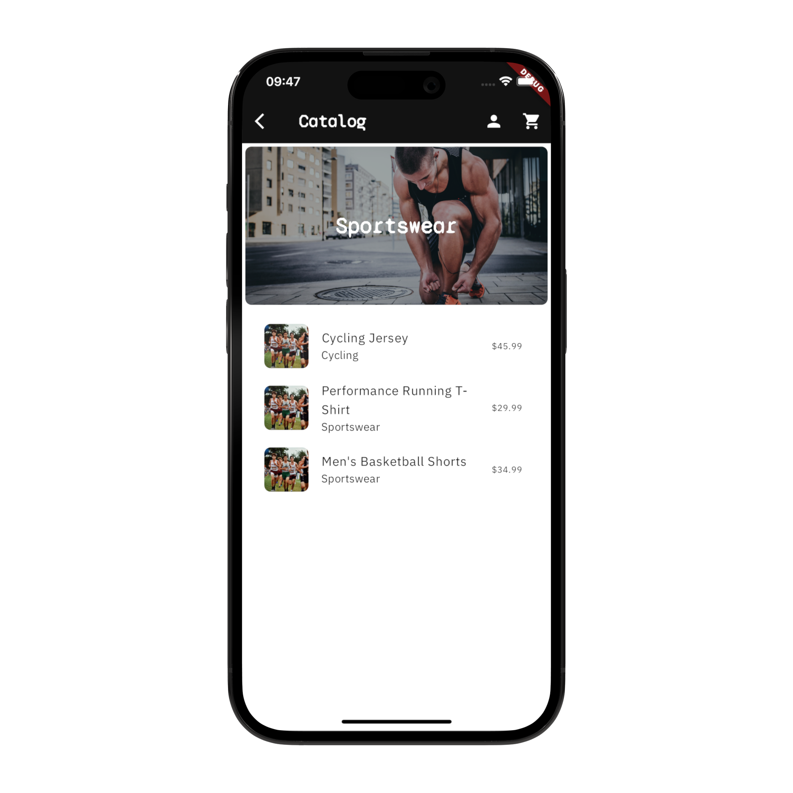
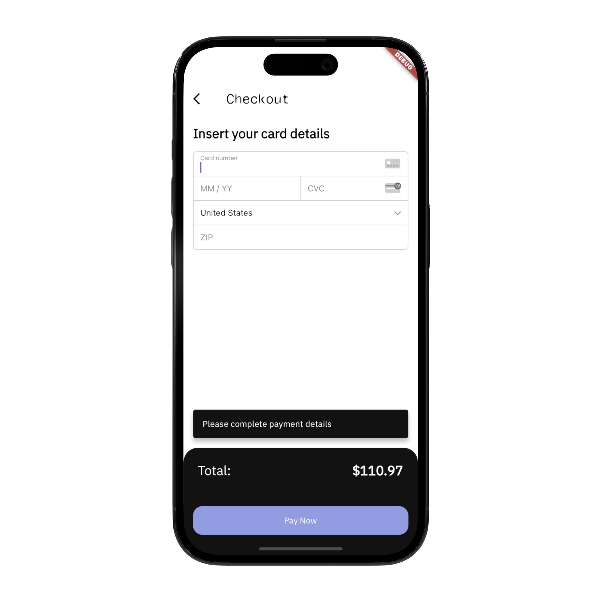
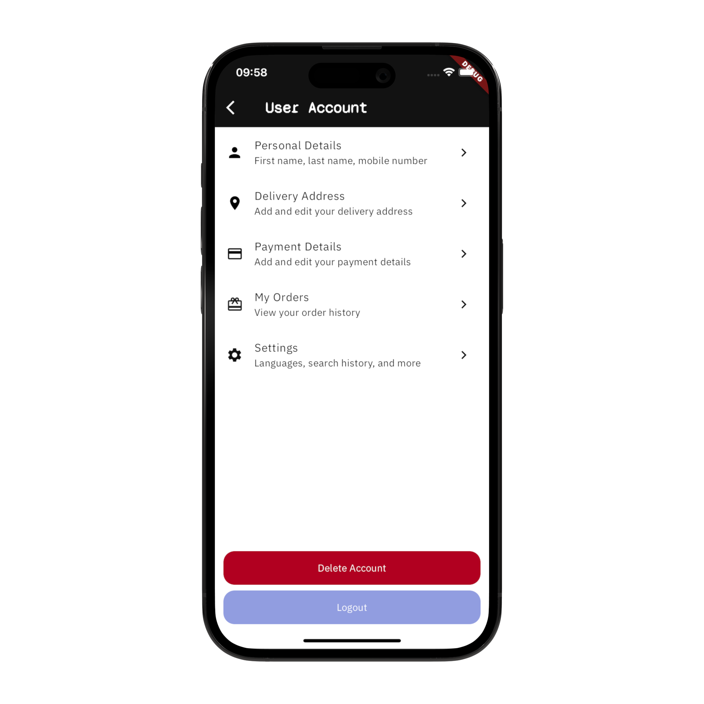

# eCommerce App with Flutter, Firebase and Stripe

The tutorial aims to display you how to build a simple eCommerce App that you can customize for your projects. It is designed using Flutter and Firebase as a backend. In addition, it allows you to easily process payments using Stripe.
The code in the repository is the starter code for the eCommerce App with Flutter, Firebase and Stripe. It will help you to follow along the video:

- YouTube video: <https://youtu.be/xYgIY_1ulhw>


## Screenshots

These screenshots represent the final eCommerce App template that is available for purchase at: coming soon

## App Screenshots

| |  |  |
|:---:|:---:|:---:|
| Home Screen | Categories Screen | Catalog Screen |
|  |  |  |
| Cart Screen | Checkout Screen | Product Screen|
|  |  |  |
| User Account Screen | Register Screen | Login Screen|

## Getting Started

The template gives you a starting point for your e-commerce app project. However, before running the app, there are a few  steps you need to take to ensure the app runs smoothly.

### Step 1: Firebase Set-Up

The template uses Firebase for Authentication, database and as well to run serverless backend logic with Cloud Functions.

1. Create a Firebase Project: Head to the Firebase Console and create a new project <https://console.firebase.google.com/>
2. Initialize Firebase Auth and enable the 'Email and Password' provider.
3. Initialize a new database with Cloud Firestore
4. Initialize Firebase in your app: <https://firebase.google.com/docs/flutter/setup?platform=ios>

### Step 2: Stripe Set-Up

The templates uses Stripe to handle all the payment processing needs. To integrate Stripe:

1. Create an account at stripe.com
2. Get the Stripe Publishable Key and the Secret Key: <https://dashboard.stripe.com/test/apikeys> (for test)
3. Add your Stripe Publishable Key as an environment variable in the .env file
    - Go in the .example.env, rename it to .env
    - Add the value of your Publishable Key.
    - Use the envied library to generate the file 'lib/env.g.dart':

```shell
dart run build_runner build
```

1. Go to your Google Cloud Project (it gets created by default as you create a new Firebase project), and register the Stripe secret key with Secret Manager
    - Go to API & Services, click on "Enable APIs and Services" and enable the Secret Manager API
    - Open Secret Manager in your Google Cloud Project
    - Create a new Secret with name equal to 'STRIPE_SECRET_KEY' and the Secret Key from Stripe as value

2. Set up the flutter_stripe library in your project.
    - There are platform specific changes to implement: <https://pub.dev/packages/flutter_stripe#installation>
    - Watch the video tutorial: <https://youtu.be/xYgIY_1ulhw>

### Step 3: Cloud Functions Set-Up

The template uses Cloud Functions on Firebase (with Python) to run the backend logic for the payments.

1. Using the Firebase CLI, run:

```shell
firebase init functions 
```

1. Select your Firebase project
2. Select Python as a language for the functions
3. Use the script below for your main.py

```python
import stripe 

from firebase_functions import https_fn
from firebase_admin import initialize_app

# TODO: Use Secret Manager to safely store and access the Stripe Secret Key
STRIPE_SECRET_KEY = '...'
app = initialize_app()


@https_fn.on_request()
def stripe_pay_endpoint_method_id(req: https_fn.Request) -> https_fn.Response:
    print(req.method, req.get_json())

    if req.method != "POST":
        return https_fn.Response(status=403, response="Forbidden")

    data = req.get_json()
    payment_method_id = data.get('paymentMethodId')
    items = data.get('items')
    currency = data.get('currency')
    use_stripe_sdk = data.get('useStripeSdk')

    # TODO: Calculate the total price
    # You should always calculate the order total on the server to prevent
    # people from directly manipulating the amount on the client
    total = 1400

    try: 
        if payment_method_id:
            print(payment_method_id)
            params = {
                'payment_method': payment_method_id,
                'amount': total,
                'currency': currency,
                'confirm': True,
                'use_stripe_sdk': use_stripe_sdk,
                'automatic_payment_methods': {
                    'enabled': True,
                    'allow_redirects': 'never',
                },
            }
            intent = stripe.PaymentIntent.create(api_key=STRIPE_SECRET_KEY, **params)
            # return https_fn.Response(status=200, response=intent)
            return _generate_response(intent)
        else:
            return https_fn.Response(status=400, response="Bad request")

    except Exception as e: 
        return https_fn.Response(status=500, response=str(e))

        

# @https_fn.on_request()
# def stripe_pay_endpoint_intent_id(req: https_fn.Request) -> https_fn.Response:
    # return ...


def _generate_response(intent):
    if intent.status == "requires_action":
        return {
            "clientSecret": intent.client_secret,
            "requiresAction": True,
            "status": intent.status,
        }
    elif intent.status == "requires_payment_method":
        return {"error": "Your card was denied, please provide a new payment method"}
    elif intent.status == "succeeded":
        print("💰 Payment received!")
        return {"clientSecret": intent.client_secret, "status": intent.status}
    else:
        return {"error": "Failed"}
```

1. Add Stripe as a dependency to your project

```shell
cd functions

# Start the virtual environment for the functions
source venv/bin/activate

# Add the dependency 
pip install stripe

# Update the list of dependencies in the requirements.txt
pip freeze > requirements.txt

# Close the virtual environment
deactivate

```

1. Deploy the functions to Firebase

```shell
firebase deploy --only functions
```

1. Get the function endpoint URL from Firebase. Use your Cloud Function's URLs in the payment client `packages/payment_client/lib/src/payment_client.dart`

```dart
// TODO: Add your Cloud Functions URLs here
const ENDPOINT_METHOD_ID_URL =
    "...";

const ENDPOINT_INTENT_ID_URL =
    "...";
```

### Step 4: Set up the Cloud Firestore Data Bundles

The eCommerce loads the categories' data using a Data Bundle. The Cloud Firestore data are exported into a static data file using the Firestore Bundle Builder extension.

1. Install the extension into your Firebase project: <https://firebase.google.com/docs/extensions/official/firestore-bundle-builder>
2. Watch the video tutorial: <https://youtu.be/xYgIY_1ulhw>
3. Get the function endpoint URL from Firebase. Use the Cloud Function's URLs to retrieve the static file in the categories repository `lib/repositories/category_repository.dart`

```dart

  Future<List<Category>> fetchCategories() async {
    try {
      final categoriesData = await dbClient.fetchAllFromBundle(
        collection: 'categories',
        // TODO: Add your bundle URL here
        bundleUrl: '...',
      );
      return categoriesData
          .map<Category>((categoryData) =>
              Category.fromJson(categoryData.data, id: categoryData.id))
          .toList();
    } catch (err) {
      throw Exception('Failed to fetch the categories: $err');
    }
  }
```
